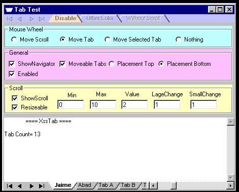



## Excel\_ent  Tab Update 11/3/2003

### Description

This is a tab like the Excel tab or CorelDraw tab, and it support mouse wheel event. Excel trademark of Microsoft Corporation, CorelDraw trademark of Corel Corporation.
 
### More Info
 

             |
---                |---
**Submitted On**   |2003-11-02 16:42:10
**By**             |[Jaime Abad](https://github.com/Planet-Source-Code/PSCIndex/blob/master/ByAuthor/jaime-abad.md)
**Level**          |Intermediate
**User Rating**    |5.0 (40 globes from 8 users)
**Compatibility**  |VB 6\.0
**Category**       |[Custom Controls/ Forms/  Menus](https://github.com/Planet-Source-Code/PSCIndex/blob/master/ByCategory/custom-controls-forms-menus__1-4.md)
**World**          |[Visual Basic](https://github.com/Planet-Source-Code/PSCIndex/blob/master/ByWorld/visual-basic.md)
**Archive File**   |[Excel\_ent\_1667031132003\.zip](https://github.com/Planet-Source-Code/jaime-abad-excel-ent-tab-update-11-3-2003__1-49595/archive/master.zip)

